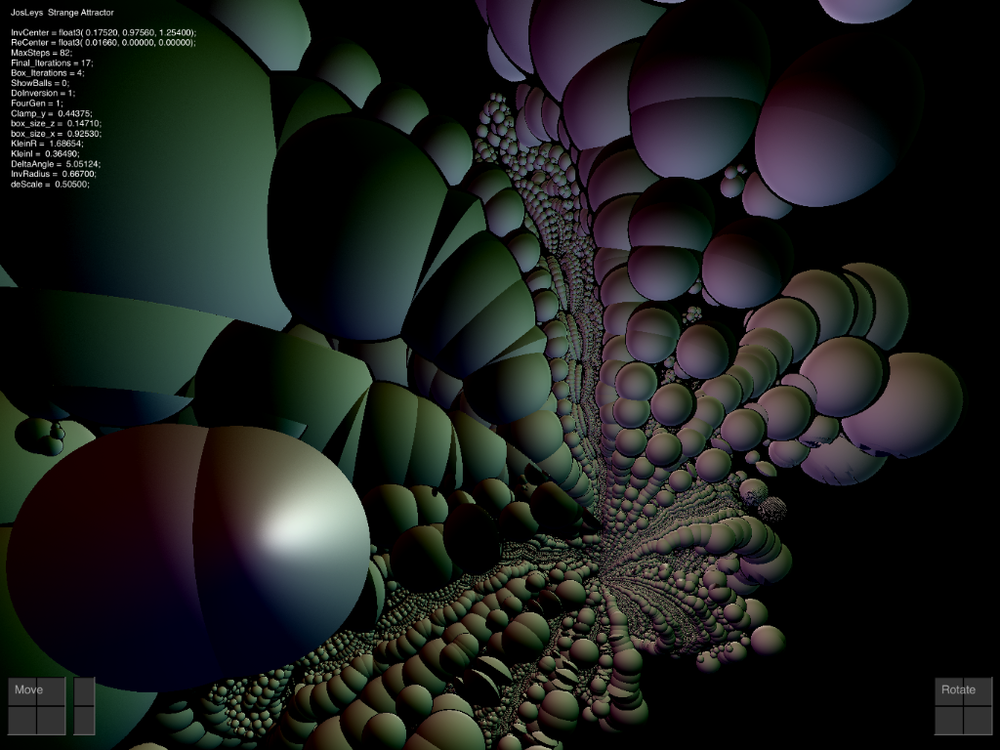
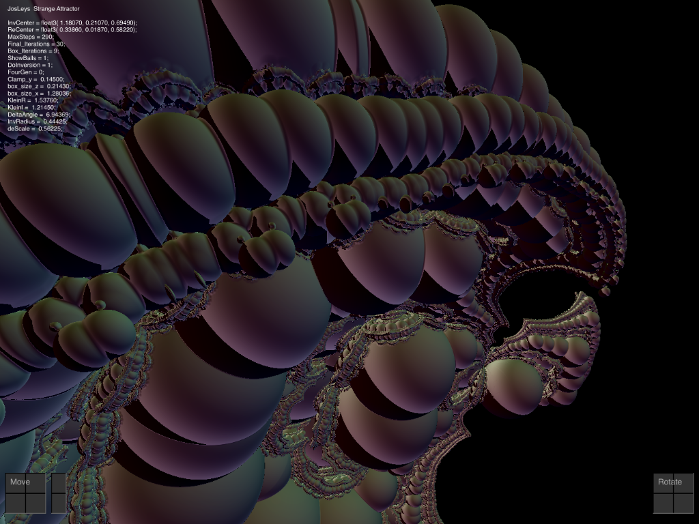
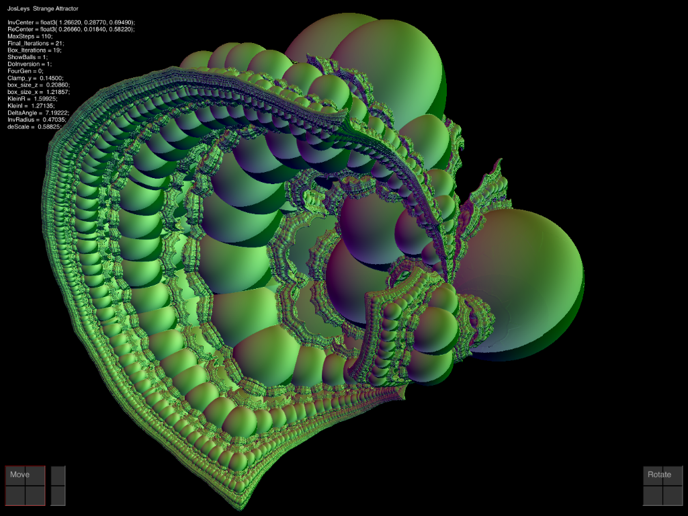

# JosLeysKleinian
Very Interesting RayMarching Fractal for iPad uses Swift and Metal

Please visit: \
http://www.fractalforums.com/3d-fractal-generation/an-escape-tim-algorithm-for-kleinian-group-limit-sets/45/

This app is an iPad rendition of "Kleinian_Jos_001.frag"  linked on that page.

Too lazy to write a help page.  Please refer to the Help page of my MandelBox2 app.

Update ---------------------------------- \
Added Default Recordings. \
I have always faced this problem: What is the easiest way to provide a bunch of recorded datasets \
along with the app? \
This latest posting shows the method I chose: 

Two new funcs and a list of Strings.
1. You set a breakpoint in the code, alter a variable value, then continue to call a new routine that \
   saves all dataset recordings as a list of base64 strings, and prints this list to the console window.
2. Copy/Paste that source code to SaveLoadViewController.swift 
3. The second new routine is called when the Save/load dialog is loaded.
   It checks whether any saves exist.  
   If not, then this is a new install, so access the base64 list to Save the datasets to the users' sandbox.
   
4. Simple and automated, and easy to paste into all the other apps.. 

 
 
