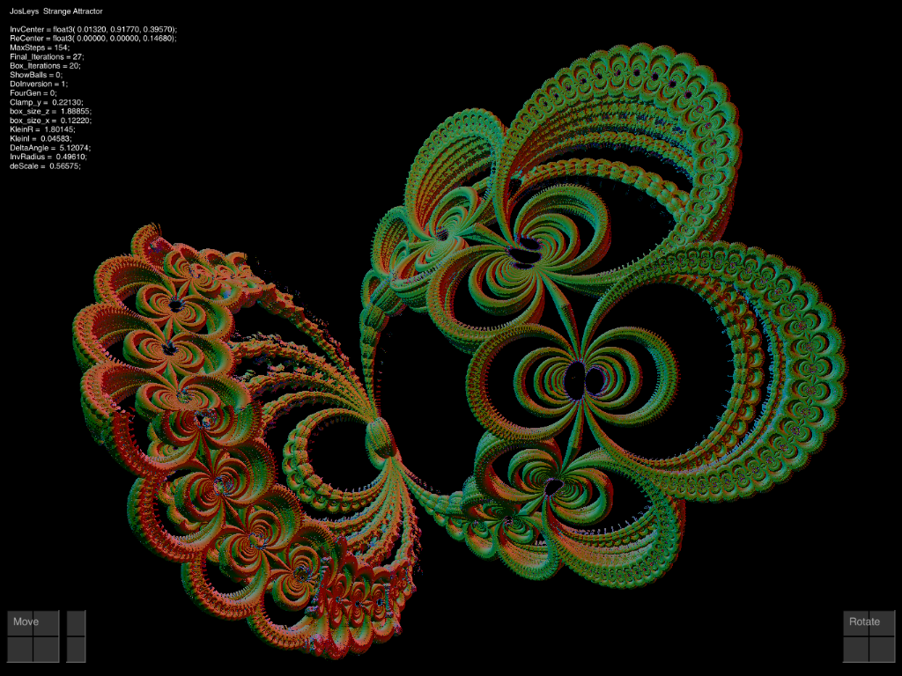

# JosLeysKleinian
Very Interesting RayMarching Fractal for iPad uses Swift and Metal

Please visit: \
http://www.fractalforums.com/3d-fractal-generation/an-escape-tim-algorithm-for-kleinian-group-limit-sets/45/

This app is an iPad rendition of "Kleinian_Jos_001.frag"  linked on that page.

Too lazy to write a help page.  Please refer to the Help page of my MandelBox2 app.

Update ---------------------------------- \
Added Default Recordings. \
I have always faced this problem: What is the easiest way to provide a bunch of recorded datasets \
along with the app? \
This latest posting shows the method I chose: 
1. Set the params to produce an image you like, then launch Save/Load, and press any 'Save' button. 
2. In the console window of Xcode, some source code will be printed. 
3. Copy/Paste that source code to ControlDisplay.swift, and add the function name to the \
   defaultRecordingsList[] array at the bottom of file. 
   
How to access these 'default recordings': \
Press the 'Default' button on the upper left of Save/Load popover to display the list of recordings you saved.
Update ---------------------------------- 

 
 
