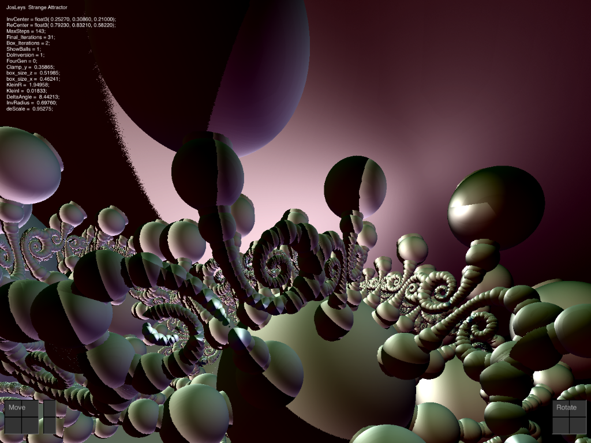

# JosLeysKleinian
Very Interesting RayMarching Fractal for iPad uses Swift and Metal

Please visit: \
http://www.fractalforums.com/3d-fractal-generation/an-escape-tim-algorithm-for-kleinian-group-limit-sets/45/

This app is an iPad rendition of "Kleinian_Jos_001.frag"  linked on that page.

Too lazy to write a help page.  Please refer to the Help page of my MandelBox2 app.

 
 
